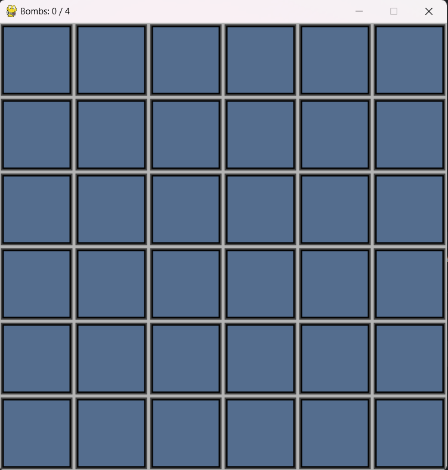
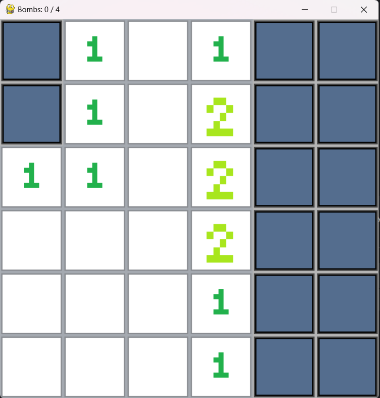
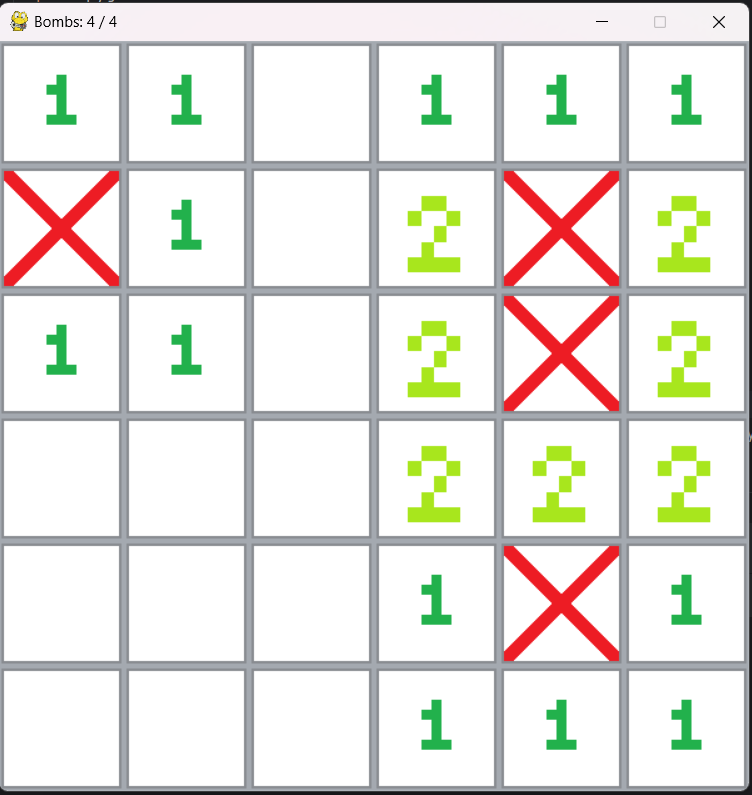
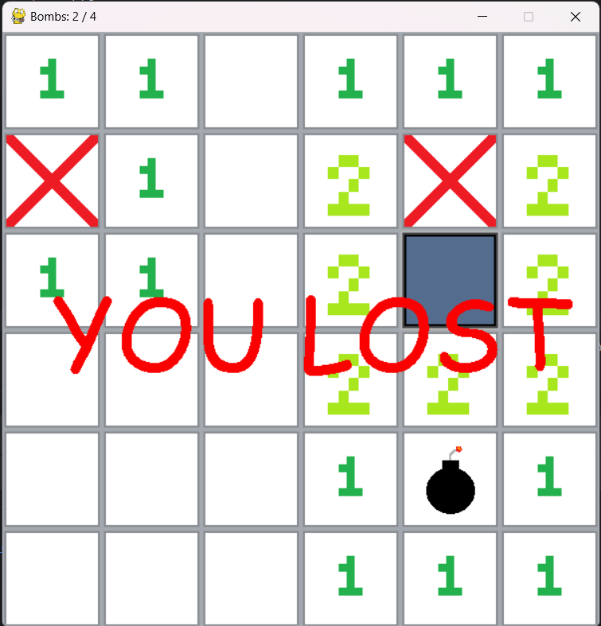

Minesweeper Game

Welcome to Minesweeper, a classic puzzle game where your objective is to clear the minefield without detonating any mines!

Instructions:
1. Objective: The goal of the game is to uncover all the squares on the grid that do not contain mines.
2. Grid: The game begins with a grid of covered squares. Some of these squares contain mines. You must uncover the squares without mines to win.
3. Uncover Squares: Click on a square to uncover it. If the square contains a mine, you lose the game.
4. Numbers: If a square does not contain a mine, it will display a number indicating how many adjacent squares contain mines.
5. Flags: You can place flags on squares that you suspect contain mines to help you keep track.
6. Winning: You win the game when all squares without mines are uncovered.
7. Losing: You lose the game if you uncover a square containing a mine.

Controls:
- Left Click: Uncover a square.
- Right Click: Place or remove a flag on a square.
- Space: Check whether you placed flags correctly.

Features [IN DEVELOPMENT]:
- Game menu
- Three Difficulty Levels: Choose from Easy, Medium, or Hard to adjust the size of the grid and the number of mines.
- Custom Grid Size: Create a custom grid size with a desired number of mines for a tailored challenge.
- High Scores: Keep track of your best times for each difficulty level.

How to Run:
- Ensure you have Python 3 installed on your system.
- Clone or download the repository.
- Navigate to the project directory.
- In the terminal, run the command: ```pip install -r requirements.txt``` to install necessary dependencies.
- Run the main.py file using Python.

Credits:
Developed by [Kacper Zakrzewski]
Enjoy the game and happy mine sweeping!

Screenshots:

  
Starting board

  
Board with discovered fields

  
Board with flags placed

  
Discovered bomb